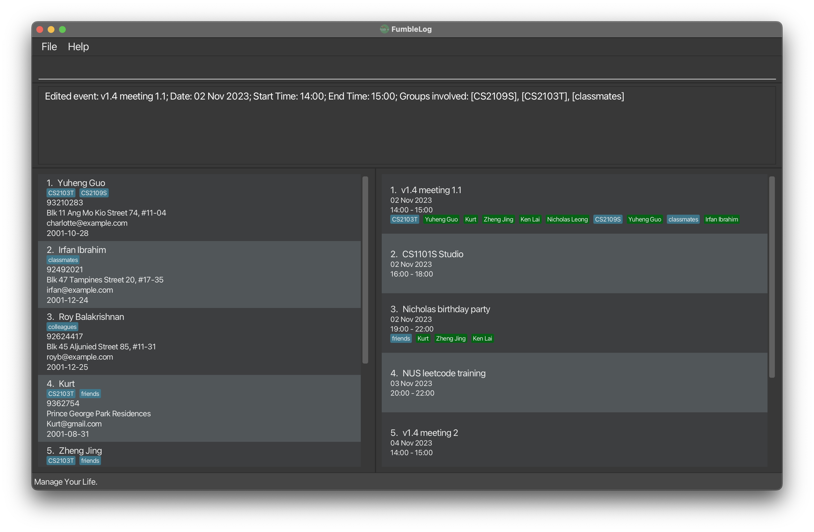

FumbleLog
* The product is targeted at university students who want to get better control over their inter-personal relationships and commitments. 
* In university, people tend to forget certain deadlines and events (interpersonal agendas) or commitments due to their hectic lifestyles. 
* This product is user-friendly and GUI oriented. It is optimized for use via a Command Line Interface (CLI) while still having the benefits of a Graphical User Interface (GUI).
* This project is based on the AddressBook-Level3 project created by the [SE-EDU initiative](https://se-education.org)**.